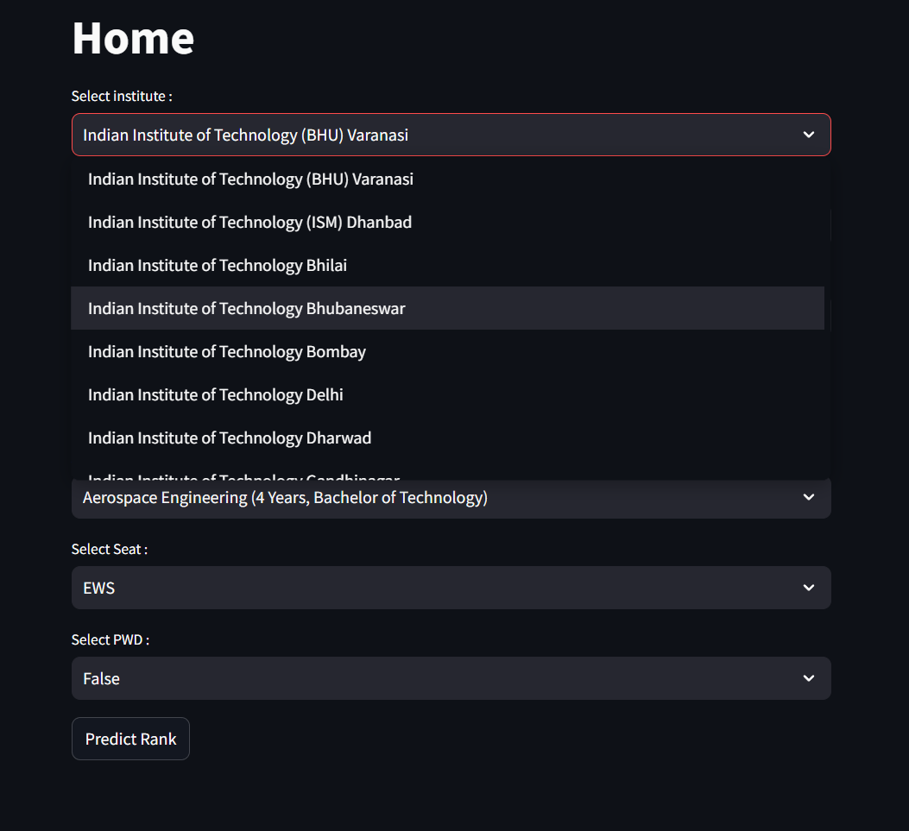

# Jee Ranking Recommendation System


A deep learning-based model designed to predict opening and closing ranks across various domains in IIT colleges. Additionally, it allows you to analyze IIT rankings and seat allocations from 2016 to 2024.

## Table of Contents

- [Overview](#overview)
- [Parameters](#parameters)
- [Installation](#installation)
- [Usage](#usage)
- [Features](#features)
- [Screenshots](#screenshots)
- [Performance](#performance)
- [FAQ](#faq)
- [Tech Stack](#tech-stack)
- [Contributing](#contributing)
- [Live_Model_Links](#live_model_links)
- [License](#license)
- [Contact](#contact)

---

## Overview

The Jee Recommendation Model is a machine learning-based system for predicting future seat allocation rankings using deep neural networks. It is tailored to assist students in understanding trends and making informed decisions about their academic choices.

---

## Parameters

The model takes the following input parameters:

- **Institute Name with Specialized Course**: Specify the institute and course details.
- **Quota**: Applicable quota, e.g., AI (All India).
- **Gender**: Choose between 'Gender Neutral' for males or 'Female'.
- **Year**: The academic year for analysis.
- **Academic Program**: The program you wish to pursue.
- **Seat Type**: Category of seat allocation.
- **PWD Type**: Whether the applicant has a disability (Yes/No).

---

## Installation

### Prerequisites

- Python 3.8 or higher
- Required dependencies listed in `requirements.txt`

### Steps

1. Clone the repository:
   ```bash
   git clone https://github.com/AyushJainSparsh/JeeRecommendationSystem.git
   ```
2. Navigate to the project directory:
   ```bash
   cd JeeRecommendationSystem
   ```
3. Install dependencies:
   ```bash
   pip install -r requirements.txt
   ```

---

## Usage

### Running the Application

1. Start the application:
   ```bash
   streamlit run main.py
   ```
2. Access the application in your web browser at:
   ```
   http://localhost:8501
   ```

---

## Features

- Predict future opening and closing ranks with high accuracy.
- Analyze historical seat allocation data from 2016-2024.
- User-friendly interface for parameter input and result visualization.

---

## Screenshots

 





---

## Performance

- **Model Architecture**: The ANN consists of 4 layers, including an input layer, two hidden layers with 64 and 32 neurons respectively, and an output layer. ReLU activation is used for hidden layers, and a softmax function is applied in the output layer.
- **Dataset**: The model was trained on a dataset containing historical seat allocation data from 2016 to 2024, consisting of 20,000 records.
- **Accuracy**: Achieved 77% accuracy on the test dataset.
- **Evaluation Metrics**:
  - Mean Absolute Error (MAE):  0.2730918526649475
  - R2_Score : 0.7746634929494804
- **Hardware Used**: Trained on an NVIDIA RTX 3060 GPU for optimal performance.

---

## FAQ

**Q:** What if my institute or program is not listed?\
**A:** Please raise an issue on GitHub, and we’ll update the dataset.

**Q:** Can I use this system for non-IIT institutions?\
**A:** Currently, the model is optimized for IITs only.

---

## Tech Stack

- **Backend**: Python, TensorFlow, Streamlit
- **Frontend**: Streamlit
- **EDA**: Microsoft Power BI

---

## Contributing

Contributions are welcome! Please follow these steps:

1. Fork the repository.
2. Create a new branch:
   ```bash
   git checkout -b feature-name
   ```
3. Make your changes and commit them:
   ```bash
   git add .
   git commit -m "Add feature"
   ```
4. Push to the branch:
   ```bash
   git push origin feature-name
   ```
5. Open a pull request describing your changes.

---

## Live_Model_Links

- **Jee Recommendation Model**: [View Here](https://ajs-jee-recommendation.streamlit.app/)  
   Access the deployed model to predict Jee Based Top College Seat Allocation Opening and Closing Rank based on user-specific inputs.

- **Other Deployed Models**: [View My Model Collection](https://linktr.ee/joyboy0599)  
  Explore other models and projects available on my Linktree.


---


## License

This project is licensed under the [MIT License](https://github.com/AyushJainSparsh/JeeRecommendationSystem/blob/main/LICENSE).

---

## Contact

For questions or suggestions:

- **Maintainer**: [Ayush Jain Sparsh](mailto\:ayushjainsparsh2004.ajs@gmail.com)
- **GitHub**: [https://github.com/AyushJainSparsh](https://github.com/AyushJainSparsh)

Feel free to raise issues or suggest improvements in the repository's [issue tracker](https://github.com/AyushJainSparsh/JeeRecommendationSystem/issues).

